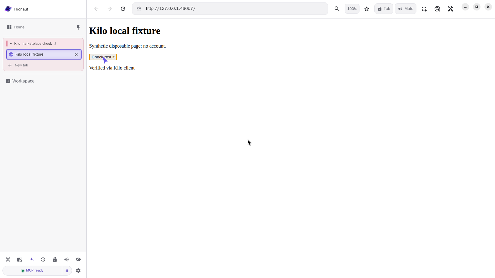

# Kilo 7.7.3 with packaged Hronaut: protected global connection

**Checked September 18, 2026:** the released Kilo **7.7.3** local server installed a global MCP connection to the actual Hronaut **2.4.25 Linux amd64 Debian package**, used that connection to operate a synthetic local page, and explicitly resumed the same tab after disconnect/reconnect. The same **19 assertions passed in two fresh containers**, including an expected project-scope exclusion. This does **not** mean 19 supported installation combinations.

**Important boundary:** project installation saved the entry, but Kilo skipped the server when its project-level headers contained an environment reference. Protected **global** setup worked. Do not treat an installation receipt alone as a working connection, disable Hronaut authentication, or put a literal token in a shared project to avoid this boundary.

## What was actually tested

- Kilo's released local server and its real `/kilocode/marketplace/install` / removal paths, not a rewritten imitation of its installer. The upstream catalogue did not contain a Hronaut entry; a local test entry was supplied directly to this API. No marketplace submission or acceptance is implied.
- The installer converted `streamable-http` metadata to Kilo's `remote` configuration, preserved the explicitly configured permission rules and an unrelated disabled MCP entry, rejected a duplicate project install, and kept project/global removal separate.
- Global bearer authentication used a newly generated disposable Hronaut token supplied only to the child process. Tracked/test configuration held the environment reference, not the token. Unauthenticated Hronaut health and Kilo-server requests were rejected.
- Browser tools ran through **Kilo's experimental MCP Apps tool-call endpoint** and its actual connected MCP client. The harness did not make these browser calls with its own MCP SDK client. This is **not a model-driven agent run or a test of Kilo's normal permission prompts**.
- Kilo created a scratch workspace, opened the synthetic page, read the initial state, clicked its control, and read the changed result. Native page text, local storage and fresh tool output agreed.
- After disconnect/reconnect, Kilo's new client did not inherit the workspace and an ID-only request was denied. Explicit resume with the private capability restored the original tab and result. That capability stayed in process memory.

## Configuration produced by the global install

This is the tested configuration shape, **not a command to overwrite an existing file**. Merge only the intended entry into your global Kilo configuration, preserve other settings, and follow the [Hronaut setup guide](https://hronaut.dev/setup) for your own installation. Hronaut must already be running on the same machine.

```json
{
  "mcp": {
    "hronaut": {
      "type": "remote",
      "url": "http://127.0.0.1:47812/mcp",
      "oauth": false,
      "headers": {
        "Authorization": "Bearer {env:HRONAUT_MCP_TOKEN}"
      }
    }
  }
}
```

The process running Kilo must receive the token through the named environment variable; never commit its value. Here `oauth: false` selects the bearer-header setup rather than automatic OAuth; it does not turn off Hronaut authentication. The experiment generated its own disposable token and did not test an end user's token-copy/onboarding interaction. Do not expose the loopback endpoint through a public tunnel.

Kilo's [version-pinned project-header policy](https://github.com/Kilo-Org/kilocode/blob/v7.7.3/packages/opencode/src/kilocode/config/mcp-headers.ts) explicitly excludes environment/file references in project MCP headers. Its [marketplace installer](https://github.com/Kilo-Org/kilocode/blob/v7.7.3/packages/opencode/src/kilocode/marketplace/installer.ts) implements the transport normalization and scoped writes. This observed project exclusion is not asserted to be a Hronaut defect or a restriction to bypass.

## Evidence and iteration history

[Machine-readable final result](kilo-marketplace-result.json) and [executed harness](kilo-marketplace-probe.mjs). The harness expects the dependency-equipped, disposable container described below; it is not a standalone installer. Its explicit project-exclusion assertion prevents a later summary from calling that path connected.

Two earlier exploratory runs are **not counted as passing runs**: the first stopped because it incorrectly expected the protected project entry to connect. The second encountered Kilo's existing legacy bash-permission migration when the fixture omitted an explicit bash rule. The final fixture sets `bash: deny`, verifies that baseline before installation, and keeps it unchanged. No Kilo or Hronaut source was patched. See Kilo's [version-pinned migration implementation](https://github.com/Kilo-Org/kilocode/blob/v7.7.3/packages/opencode/src/kilocode/config/config.ts); this observation is not attributed to marketplace installation alone.



The screenshot supports the visible result, not the whole sequence or client identity by itself. Runtime assertions establish those steps. Both final native captures were reviewed.

## Environment and limits

Ubuntu 24.04 Docker/Xvfb, non-root UID 1000, Node **24.18.1**, fresh app/project/global settings, no host user profile or Docker socket mounted, runtime network disabled except container-local loopback, no published ports. Kilo's local server also used a fresh test-only basic-auth credential. No owner credential, model-provider account, paid inference, customer page, wallet or real funds.

The [existing installed-package test image](linux-deb-2.4.25-check.md) supplied the actual Hronaut package. Kilo's [v7.7.3 Linux x64 archive](https://github.com/Kilo-Org/kilocode/releases/tag/v7.7.3) was 64,587,845 bytes; SHA-256 `9989ba0c0ca6c02aeda7592f9daab6aed4494648186a72dc53f409dfb623f4d6` matched GitHub asset metadata. This digest check is not a signature or security certification.

Not checked: VS Code marketplace UI/catalogue discovery, marketplace metadata generation, a full LLM-agent task, ordinary permission prompts, end-user credential handoff, native OS sandbox integration, other platforms, crash recovery, app restart in this experiment, upgrade/uninstall, external sites or security generally. `--no-sandbox` was used **only inside the isolated test container**, not recommended for an end user's desktop. Separate [SDK package/restart evidence](linux-deb-2.4.25-check.md) retains its own scope.

Project-produced, AI-assisted evidence, not independent certification or Kilo endorsement. Hronaut remains source-available under its [Subscription and Trial License](https://github.com/hronaut/hronaut/blob/v2.4.25/LICENSE): one 10-day trial from the first agent tool call, then $4/month or $24/year per named user, up to three active devices. The binaries remain unsigned and Mac builds are not Apple-notarized; this experiment changes none of those terms or limitations.
