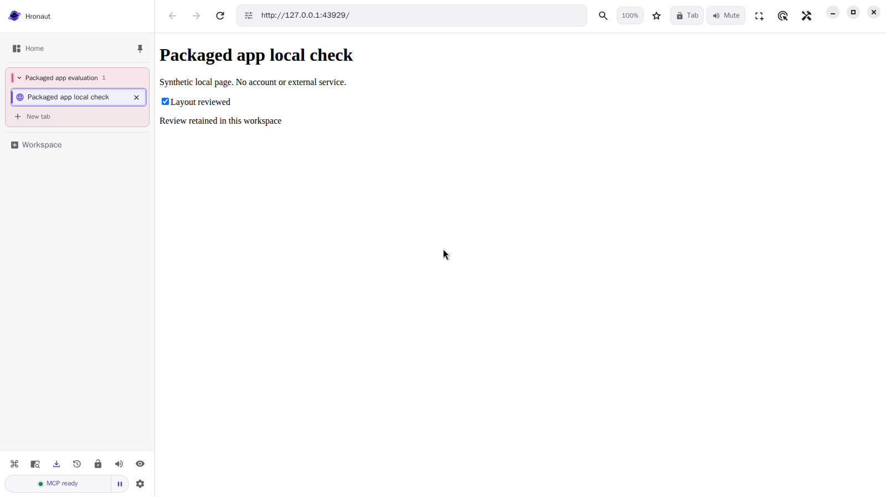

# Hronaut 2.4.25: a packaged Linux first-run check

**Result:** the published Linux amd64 `.deb` was installed and ran **21 focused checks successfully in each of two fresh containers** on September 18, 2026 (Europe/Kyiv). These are the same 21 checks repeated, not 42 distinct tests or a full regression suite.

This is separate from the **2.4.24 source-build videos**. Their versions and test limits have not changed.

A later [mcp-use client-library check](mcp-use-client-check.md) repeats the workflow through `@mcp-use/client` 2.3.1 with its own result and connection example. The evidence below remains the original MCP SDK-only run.

## What ran

The actual [v2.4.25 release package](https://github.com/hronaut/hronaut/releases/tag/v2.4.25), not a replacement source build:

- `hronaut-2.4.25-amd64.deb`, 115,640,352 bytes.
- SHA-256: `b9855ad99c1c1cc047cd3597b22e1e31d1c968e9dc22a43d95dc36a9606c63db`.
- Digest matches the published checksum file and GitHub asset metadata. GitHub attestation verification also identifies the expected release workflow, tag and source commit `d8419e7ff933e6f0158e4364b5ae0d5cdf1f322c`. Provenance is not a platform signature or proof that every release-workflow job succeeded.
- Ubuntu 24.04 test container with Xvfb, Node 24.18.1 and MCP SDK test clients. The package manager reports `install ok installed 2.4.25`; the running application reports version `2.4.25` and `isPackaged: true`.

Runtime used a non-root test user, no network beyond container-local loopback, no published ports and a fresh disposable application profile. No personal browser profile, credentials, real website, wallet or funds were involved. The container's two missing declared prerequisites (`libnotify4` and `xdg-utils`) were installed before the package; no dependency was bypassed.

## Observable workflow

1. Launch the installed application, open Home through its visible control, connect over the default unauthenticated loopback MCP endpoint and discover the browser tools.
2. Create a scratch workspace, open a synthetic local checklist, check an item through MCP, and compare the page, local storage and a fresh semantic snapshot.
3. Disconnect the first client. The visible checked result remains. A second client lists no owned workspace and cannot access this one by its ID alone; its private resume capability restores access to the original tab and checked result.
4. Close the application cleanly and start it again with the same disposable profile. A third client must again resume explicitly. The original tab identity, stored checkbox value, rendered result and fresh snapshot are retained.

The private resume capability stayed in test-process memory and is not included in the evidence.

The unedited native-display screenshot supports the visible result; the runtime assertions, not the screenshot alone, establish the sequence. [Machine-readable result and all check names](linux-deb-2.4.25-result.json). Final run: `2026-09-17T21:16:53.792Z` (September 18, 00:16:53 EEST).

## Important limits

The test used **`--no-sandbox` only inside the isolated container** because this environment cannot exercise the ordinary desktop namespace/sandbox path. This is **not an end-user launch recommendation** and does not verify native desktop sandbox, AppArmor or FUSE integration.

It does not test Windows, macOS, ARM, RPM, AppImage, authenticated first-run setup, a named coding-agent integration, an MCPB desktop-host installation, crash/power-loss recovery, upgrade/uninstall, external website compatibility or security generally. The MCPB setup/host question remains separate. No product fix was made to obtain these passes.

Published by the Hronaut project; the test harness and write-up were AI-assisted. This is project-produced evidence, not an independent certification. For your own evaluation, follow the [supported setup guide](https://hronaut.dev/setup) and [download verification guidance](https://hronaut.dev/security#verify-release). Hronaut is source-available under its [Subscription and Trial License](https://github.com/hronaut/hronaut/blob/v2.4.25/LICENSE), not OSI open source; this check does not change its trial or subscription terms.
