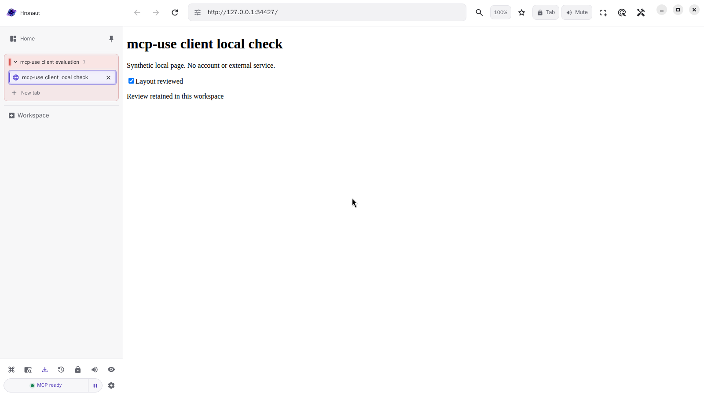

# Connecting mcp-use's client to packaged Hronaut

**Checked September 18, 2026 (Europe/Kyiv):** `@mcp-use/client` **2.3.1** connected to the published Hronaut **2.4.25 Linux amd64 Debian package**, operated a synthetic local page, explicitly resumed its workspace across client connections, and retained the original tab/result after a clean application restart.

The same **21 focused checks passed in two fresh isolated containers**. This is a client-library interoperability check, **not an LLM-agent end-to-end test, partnership or certification**. It is separate from the [earlier SDK-only package check](linux-deb-2.4.25-check.md) and the [2.4.24 source-build video](README.md).

## Connection pattern

Install the client package in a disposable Node project. This check used Node **24.18.1**, `@mcp-use/client@2.3.1` and `zod@4.6.5`; the published client requires Node **22.22.2 or newer**. Follow Hronaut's [supported setup](https://hronaut.dev/setup) and connect only to your trusted local application.

The following is the connection pattern used by the check, reduced to discovery and listing owned workspaces:

```js
import { MCPClient } from '@mcp-use/client';

const localClient = new MCPClient({
  mcpServers: {
    hronaut: {
      url: 'http://127.0.0.1:47812/mcp',
      oauth: false,
      timeout: 15000,
      clientInfo: { name: 'Hronaut local client example', version: '1.0.0' },
    },
  },
});

try {
  const connection = await localClient.connect('hronaut');
  const tools = await connection.listTools();
  console.log(tools.map(tool => tool.name));
  const owned = await connection.callTool('browser_workspaces', { action: 'list' });
  console.log(owned);
} finally {
  await localClient.close();
}
```

This example targets the tested **default unauthenticated loopback** configuration. `oauth: false` only disables client-side automatic OAuth for that configuration; it does not bypass server authentication. Do not use it as an authenticated-setup recipe or expose the endpoint through a public tunnel. Set `MCP_USE_ANONYMIZED_TELEMETRY=false` in the test process before importing the client if reproducing the telemetry-disabled setup. No LLM-provider key or account was used.

The current [mcp-use client documentation](https://docs.mcp-use.com/typescript/client) and [tool-call documentation](https://docs.mcp-use.com/typescript/client/tools) describe this package/API. All three test clients negotiated **legacy protocol `2025-11-25`** with Hronaut; the package version is not the negotiated protocol version.

## What the complete check observed

1. The actual installed application reported `2.4.25` and `isPackaged: true`. Client A discovered the browser tools, created a scratch workspace and checked a local checklist item. The DOM, local storage and fresh semantic snapshot agreed.
2. After A disconnected, client B listed no owned workspace. A workspace ID alone was denied; its private resume capability restored access to the original tab and result.
3. After a clean application close/relaunch with the same disposable profile, client C again needed explicit resume. The original tab ID, stored checkbox state and fresh visible result remained.

The private capability stayed in process memory and is not in the evidence. The [machine-readable result](mcp-use-client-2.3.1-result.json) contains all check names and negotiated versions. Final run: `2026-09-17T21:49:59.935Z`.



## Scope and limits

Ubuntu 24.04/Xvfb, non-root UID 1000, isolated container with networking disabled except its own loopback, no published ports, fresh application profile, no user home or Docker-socket mount. The test used `--no-sandbox` **only inside that container**; this is **not an end-user recommendation** or evidence of native desktop sandbox/AppArmor/FUSE behavior.

Not checked: an LLM agent, React hooks, browser-side client, OAuth/bearer-auth setup, MCPB desktop-host install, Windows/macOS/ARM, other package formats, external websites, wallets, crash/power-loss recovery, upgrade/uninstall or general security. Automatic updates were disabled for the disposable test, not on a user's installation. No Hronaut source or dependency was patched to obtain these passes.

Hronaut project-produced, AI-assisted evidence. Hronaut remains [source-available under its Subscription and Trial License](https://github.com/hronaut/hronaut/blob/v2.4.25/LICENSE), not OSI open source: one 10-day trial from the first agent tool call, then $4/month or $24/year per named user. This check does not change those terms or imply an endorsement by mcp-use.
